<!DOCTYPE html>
<html lang="en">
<head>
    <meta charset="UTF-8">
    <meta name="viewport" content="width=device-width, initial-scale=1.0">
    <title>Roman Anthony vs Juan Soto Analysis</title>
    
</head>
<body>
    <nav class="side-menu">
        <strong>Anthony & Soto Analysis</strong>
        <ul>
            <li><a href="#motivation">Motivation</a></li>
            <li><a href="#planning">Planning</a></li>
            <li><a href="#methods">Methods</a></li>
            <li>
                <a href="#results">Results</a>
                <ul class="submenu">
                    <li><a href="#heatmaps">Heatmaps</a></li>
                    <li><a href="#did">DiD Effects</a></li>
                    <li><a href="#summary-tables">Summary Tables</a></li>
                </ul>
            </li>
        </ul>
    </nav>

    <main>
        
Julia Margie — julialmargie@gmail.com — jmargie@uchicago.edu

        
        
<em>To-Do: conclusions</em>

        <h1 id="header">Roman Anthony vs Juan Soto</h1>
        
        <h2 id="motivation">Motivation</h2>
        
Over the summer, Roman Anthony debuted for the Red Sox, and was immediately impactful, which resulted in lots of buzz. Some of the responses to his play stuck with me for a while because I wasn't sure if I believed the conclusions these articles came to from just a few statistics.

        
"Who he reminds me of, it's hard," Alex Cora said "I don't want to say (Barry) Bonds, of course. Probably (Juan) Soto, without the flashiness, early on. It's a good at-bat. He's not going to chase. Even when he doesn't get hits, you're like, holy s---, that's a good at-bat" (Rosenthal, Ken. 2025. "Red Sox Rookie Roman Anthony Has Passed Every Major-League Test so Far. Now He Takes on Yankee Stadium." The New York Times, August 21.)

        
"Anthony is averaging 4.25 pitches per plate appearance," Rosenthal wrote. "His walk rate is 14.6 percent. In those categories ... he would rank among the league leaders if he had enough playing time." (Keane, Colin. 2025. "Alex Cora Compares Red Sox Star To Juan Soto, With A Disclaimer." NESN.Com, August 21.)

        
"Players to rank in 95th percentile in hard-hit percentage and chase%The percentage of pitches that a batter swings at which are outside of the strike zone in 2025, there's two of them. It's Juan Soto and Roman Anthony," Mark DeRosa shared on "MLB Central." (Crisafulli, Owen. 2025. "Roman Anthony Finds Himself In Exclusive Company Alongside Juan Soto." NESN.Com, August 12.)

        
It is easy to mislead people with statistics, especially when cherry-picked. I don't think the above people are attempting to mislead anyone, but comparing anyone to Juan Soto is a big deal! That changes a team! (Despite the 2025 Mets, unfortunately). Anthony is about my age, and despite the data not supporting it, I instinctually am fascinated by high walk rates in younger players (according to statcast, the relationship between age and BB% number of walks / number of plate appearances.  in 2025 has an r² of 0.01). Also, a recent ESPN article listed a lot of these statistics—-highlighting the walk rate—-as reasons the Red Sox should be optimistic about next year. While I am nothing if not a pessimist about the Yankees' chances in the AL East, I'd still like to be a realistic fan. If Anthony is actually a game-changing player like Soto, I'd like to regulate my expectations about the upcoming season.

        
So, let's take a look! Does Roman Anthony react to pitches like early Juan Soto?

        
Please note that I am hoping for this analysis to be accessible with minimal baseball knowledge, though I do assume a level of knowledge that includes things like walks, strikes, at-bats, and contact. Words underlined will show a definition when hovered over, and I'll try to do that for more obscure statistics. If you think something else should be defined or that I did something wrong elsewhere, feel free to email me! I always want to improve both my analysis and communication.

        <h2 id="planning">Planning</h2>
        
Before starting any analysis, I like to make sure I know exactly what question I am asking. Here, that is:

        
        <blockquote>Does Roman Anthony's plate approach at the MLB level mirror that of Juan Soto?</blockquote>

        
In order to answer this, I had to choose whether or not I wanted to compare 2025 Soto to 2025 Anthony (which would make direct numeric comparisons easier) or rookie Soto to rookie Anthony, i.e. 2018 Soto to 2025 Anthony. I decided to look at their rookie seasons, because I want the end goal of this analysis to be how Anthony might grow as a player, not just how they currently line up. Also, Cora specifically compares him to "early" Juan Soto. So, the question became:

        
        <blockquote>Does Roman Anthony's plate approach in 2025, at the MLB level, mirror that of Juan Soto in 2018?</blockquote>

        
To answer this question, I need to specify what a player's approach is. This is an exceptionally complicated question, so I narrowed once again, and considered their decision to swing, given a certain pitch location and typePitch type classification (fastball, breaking ball, offspeed) based on velocity, movement, and spin characteristics., and the quality of contact or lack thereof. Unfortunately, we can't look at squared-up rateThe percentage of swings where the exit velocity of the contact is at least 80% of what is possible, given the speed of the bat as it is swung and the speed of the pitch. before 2023 because bat speed was not tracked, so I had to consider quality of contact differently. Recall, however, that we are interested in approach rather than results, specifically whether a given player has a "good at-bat" (Cora, quoted by Rosenthal). So, I only examined swing%The percentage of pitches that a batter swings at and contact%The percentage of pitches that a batter swings at and makes contact with (regardless of result), and since DeRosa cited HardHit%The percentage of batted balls hit with an exit velocity of 95 mph or greater, indicating well-struck contact., I also looked at exit velocityThe speed of the baseball as it comes off the bat after contact (mph) . I considered isolating chase%The percentage of pitches outside the strike zone that a batter swings at, indicating plate discipline., but decided just considering swing%The percentage of pitches that a batter swings at by zone would do the same thing. We now are trying to answer:

        
        <blockquote>Does 2025 MLB Roman Anthony swing and make contact at the same rate as 2018 MLB Juan Soto after controlling for pitch location and typePitch type classification (fastball, breaking ball, offspeed) based on velocity, movement, and spin characteristics., and normalizing across seasons?</blockquote>

        
I am specifically interested in swing%The percentage of pitches that a batter swings at because DeRosa mentioned chase%The percentage of pitches that a batter swings at which are outside of the strike zone in his tweet and chase%The percentage of pitches that a batter swings at which are outside of the strike zone is a subset of swing%The percentage of pitches that a batter swings at. It is somewhat misleading to say that Anthony has a low chase%The percentage of pitches that a batter swings at which are outside of the strike zone because he has a good eye for the zone without noting that he also has a low swing%The percentage of pitches that a batter swings at in all parts of the zone.

        <h2 id="methods">Methods</h2>
        
First, instead of running a power analysis (to make sure I had enough data, because Anthony only played a little over half the season), I found a stabilization analysis through FanGraphs which found that both swing%The percentage of pitches that a batter swings at and whiff/contact% stabilized around 40PA. This meant I had enough data to begin. I downloaded all of the pitches from 2018 and 2025 from StatCast via pybaseball (baseballr was acting up).

        
I decided to do my analysis in R rather than Python (which I have more experience with) because I both wanted to get more practice with R and because it has a very straightforward library for Generalized Additive Models (GAMs) which essentially piece together a bunch of possibly non-linear relationships over a given space. This works better than linear and polynomial models, even when piecewise, because it is smooth and allows for different relationships over the surface, while ensuring the resulting model is still consistent. I also used the BAM model from the mgcv library in R because it is a modified GAM intended for larger datasets, and there are a lot of pitches thrown in the MLB over a season.

        

            
If you want more information about the models, click here!

             
            
If you have taken linear algebra, you can think of the model fitting as choosing all of our partial models from the same basis, i.e. a minimal generating set. For example, all of the formulas are some form of cubic equation, but they do not have to be the same one over the whole space. Then, we piece them together for a smooth result. The link above provides an example of a polynomial spline, which looks at each section of the data independently, then (intuitively, or, as my one of my math professors would say, morally) slides them up or down to 'match' the end points. The GAM is more complicated than this due to penalized regression (which I do not know how to do yet).

        

        
I ran this model in a few ways: (1) recognizing the pitcher and game as an effect on each pitch, which could overfit the model, and (2) not considering each pitcher/game on the resulting decision, which could prioritize certain pitchers/games for the resulting predictions, based on sample size, as well as (3) considering the typePitch type classification (fastball, breaking ball, offspeed) based on velocity, movement, and spin characteristics. of pitch (which again, could overfit the model and slowed down the processing significantly). The results were all approximately the same, but certain numbers may not align exactly because of this. I recognize that this is not best practice but since this is just a project for fun, I didn't worry too much. I differentiated these results with different colors in the graphs. I also decided against making a model specifically for whiffs, because contact predicated on swings is just the negative, and the heatmaps were more visually coherent.

        
For example, one of the swing models looked like this:

        
        <pre><code>m_swing <- bam(
    swing ~ batter_id +
    s(plate_x, plate_z, k = 20) +
    s(plate_x, plate_z, by = batter_id, k = 10, id = 1) +
    s(pitcher_id, bs = "re") +
    s(game_id, bs = "re"),
    data = df,
    family = binomial(),
    method = "fREML",
    discrete = TRUE,
    select = TRUE
)</code></pre>

        
and another:

        
        <pre><code>m_swing <- bam(
    swing ~ batter_flag +
            pitch_category +
            s(plate_x, plate_z, k = 50),
    data = df,
    family = binomial(),
    discrete = TRUE
)</code></pre>

        
The next step was creating prediction tables to granularize the data, then doing differences-in-differences analyses to regularize Roman Anthony to 2025 hitters and Juan Soto to 2018 hitters, and compare the difference between their normalized statistics.

        <h1 id="results">Results</h1>
        
        <h2 id="heatmaps">Heatmaps</h2>
        
        <h3 id="heatmapswing">Swinging</h3>
        
The heatmaps show that Soto swung more than Anthony — this is not necessarily significant. This is particularly true in the shadow of the top of the strike zone. These graphs also act as a sanity check for my models, and pass the eye-test (though, like in baseball, the eye-test does not necessarily align with the advanced numbers in statistics! In this case, though, it seems to).

        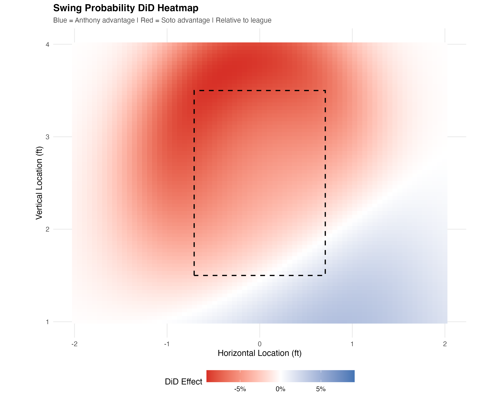
        
        
One possible limitation of this is that the strike zone will be slightly different for each batter, and the rectangle marked is just the average strike zone (vertically). Both Soto and Anthony do have similar strike zone boundaries, as set by the official scorer and StatCast. Both Soto and Anthony seem to swing less than average in the bottom of the zone, but the 2025 and 2018 league average swing locations are visually nearly identical.

        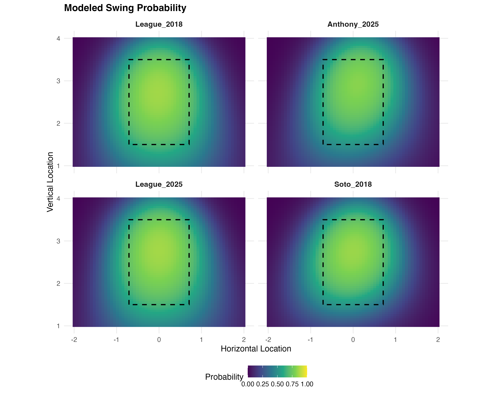
        
<em>Note: these two graphs were developed by slightly different models</em>

        <h3 id="heatmapcontact">Contact</h3>
        
Soto also made contact at a higher rate than Anthony in the bottom of the zone. This is interesting to me because Anthony swung more in this part of the zone. This seems to imply that Soto is reading pitches in the bottom of the zone better than Anthony. I did not run significance testing for top/bottom of zone, but that would be an interesting next step. It seems likely that Soto's nearly 20% higher chance at making contact around the lower edge of the zone would be significant. If I had to give Anthony advice on where to focus (if he wants to be more like Soto), I would tell him to practice making contact with pitches around his knees. Given that Soto swings less but makes more contact, it is likely that he is reading the pitches better than Anthony. Another place for further research would be the foul% and xWOBA of these contact events. Maybe Anthony's contact is more useful!

        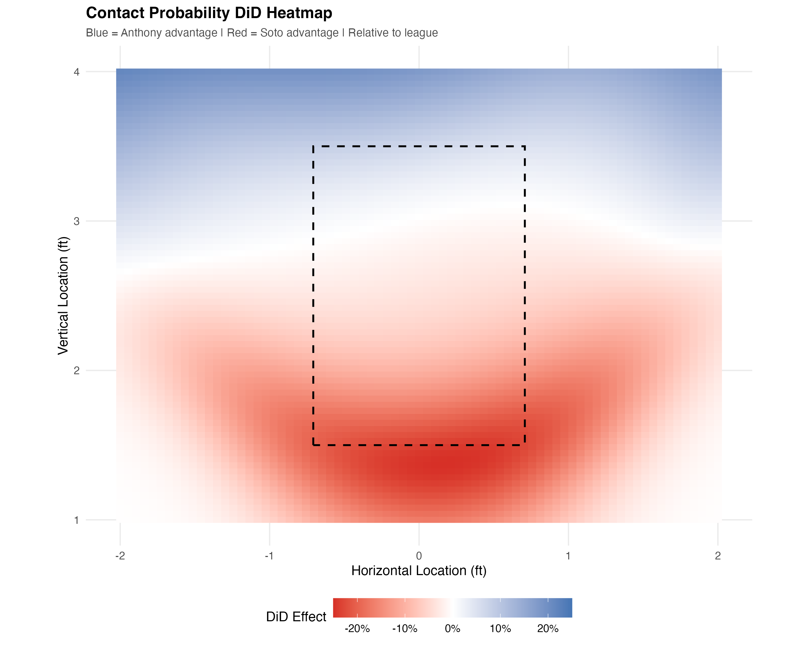

        
I think this graph is affected by the height differences of MLB players. Soto and Anthony are both on the taller side for batters, and the lower edge of the strike zone is obviously dependant on the height of a player's knee. Visually, Soto and Anthony seem to make less contact (given a swing) than average around the bottom edge of the zone, meaning they whiff more than average near their knees. A good next step for this analysis would be looking at pitches by their distance from the bottom of the declared strike zone, rather than the ground, as StatCast provides. Note that these numbers are not significant, as per later graphs and tables.

        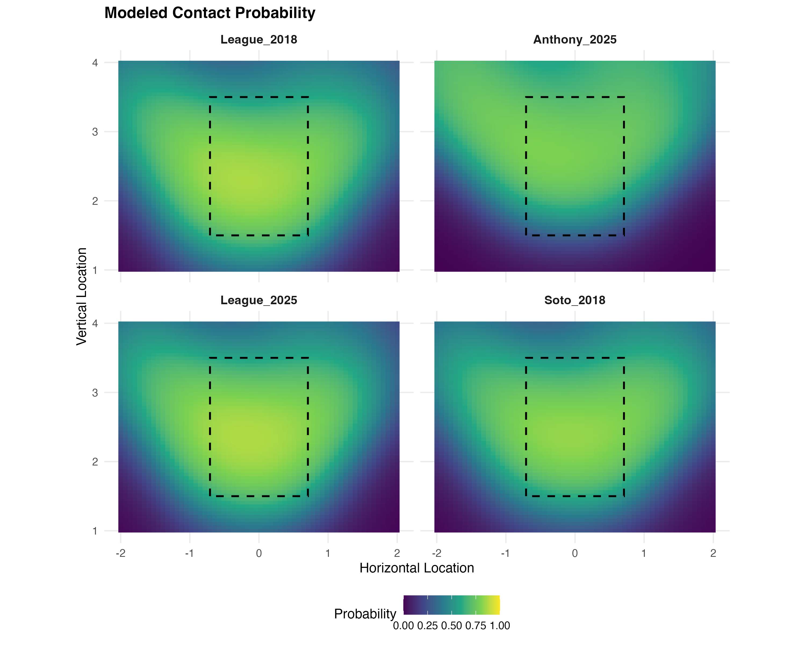

        <h3 id="exitvelo">Exit VelocityThe speed of the baseball as it comes off the bat after contact (mph) </h3>
        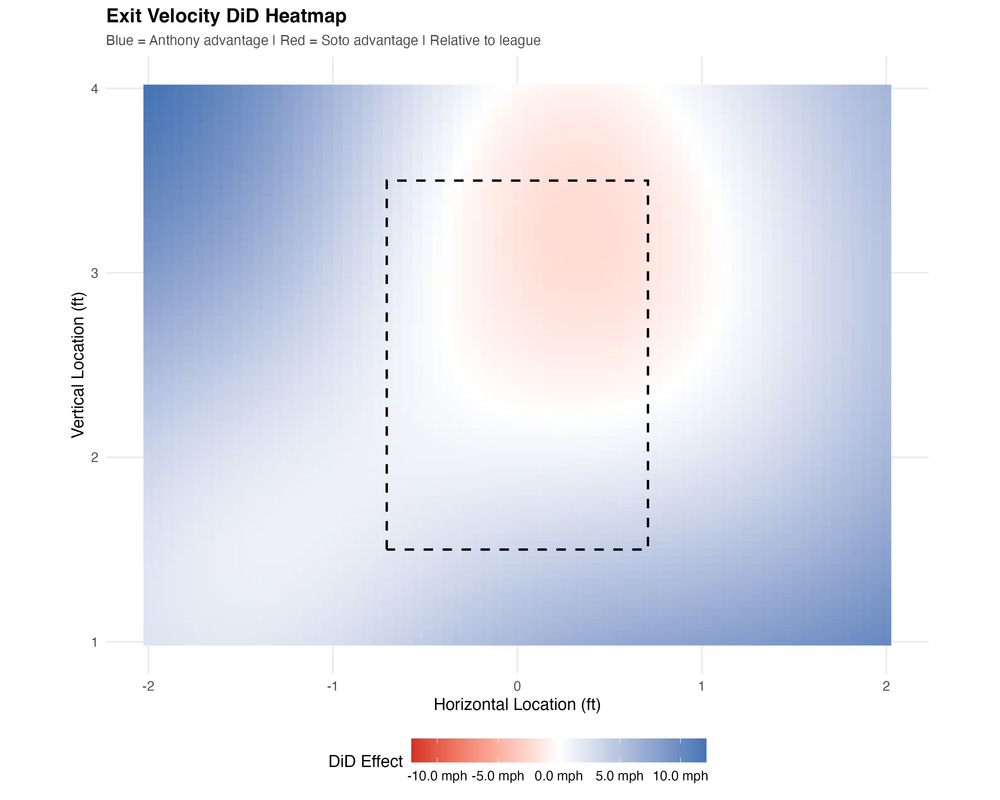

        
I added in exit velocityThe speed of the baseball as it comes off the bat after contact (mph)  at the end as an exploratory analysis, so I do not have the same graphs for it as everything else. But, this is nonetheless interesting. Rookie Anthony is getting much more power in his contact than Rookie Soto. Maybe this is because of age? Maybe Anthony is not swinging at pitches he can't get good contact on? Unfortunately, bat tracking was not implemented in 2018, which means we can't look at their squared-up rates, but in 2025, Roman Anthony had a 26.7% squared-up rate (good for 60th percentile, if he was qualified) and Juan Soto clocked in at 32.5% (92nd percentile), despite Anthony having higher bat speed, solid contact%The percentage of pitches that a batter swings at and makes contact with (regardless of result) and barrel%. Note that the squared-up rate is looking at squared-up per swing, not per contact, which disadvantages Anthony due to his (statistically significantly!) higher whiff rate.

        <h2 id="dideffects">DiD Effects</h2>
        
These graphs begin to provide significance for the prior analysis. Note that if the line is entirely above or below the axis, the result is significant. This is because the 95% confidence interval (meaning, 95% of the time, the result will fall within the given range) is entirely positive or negative. If it is positive, Anthony is statistically significantly more likely to do the given action. If it is negative, Soto is. When the line crosses the axis, it means that there is a greater than 5% chance (generally agreed to be the barrier for significance) that both Anthony and Soto are more likely to swing or make contact.

        <h3 id="didswinging">Swinging</h3>
        
In the heart of the zone, Anthony is significantly less likely to swing.

        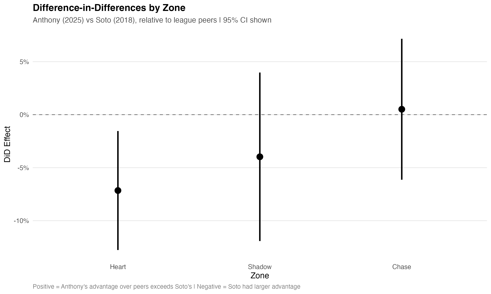
        
        
For breaking balls, Anthony is more likely to swing, regardless of zone, and for fastballs, Soto is more likely in the heart and chase areas. There is an interesting pattern among pitch categories across zones (where fastballs have the highest positive difference in Soto's probability of swinging, then offspeed pitches, and breaking balls last). Future work could be to run an omnibus test to see if these patterns are significant.

        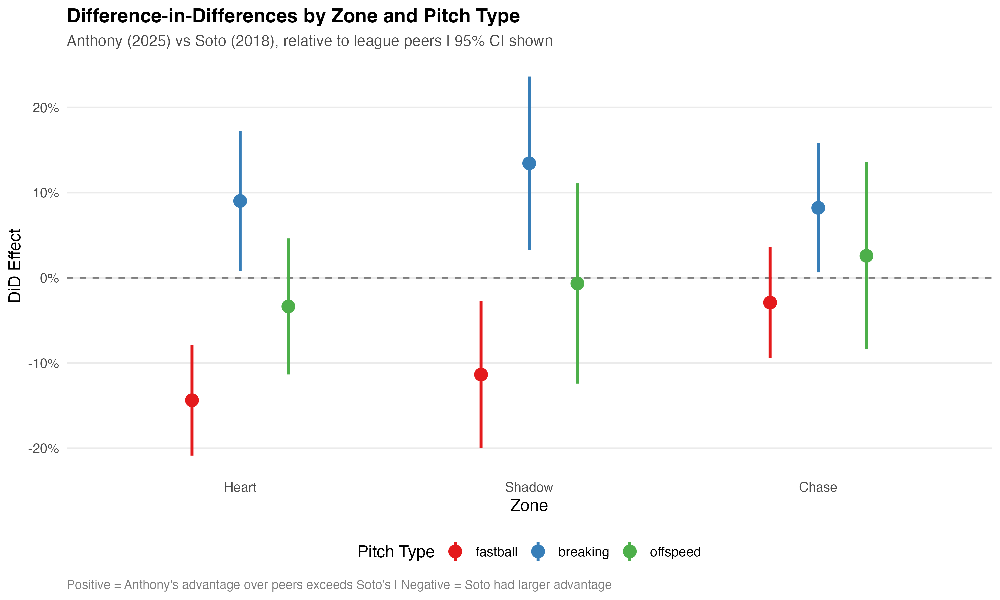

        <h3 id="didcontact">Contact</h3>
        
We have no significance regarding contact. We again see a similar pattern from above, though, where the average likelihood of contact for fastball and offspeed pitches is lower than breaking pitches. Note too that the 95% CI increases in size with chase and shadow zone pitches because there is less data for contact in these regions. This makes sense—if players swing at pitches outside of the zone less, there will be a smaller sample size than the pitches swung at inside of the zone (where you get a strike regardless of your swing).

        
        

        <h2 id="bargraph">Bar Graph Comparisons</h2>
        
I find it useful to look at the same data in different ways, which is why I included these graphs too. You can see where the differences shown in the prior graphs come from (i.e. Soto is slightly more likely than league average in 2018 to swing at a fastball in the heart of the zone, but Anthony is much less likely). These graphs should be understood in the context of the prior graphs and later tables since they do not mark significance. Below each graph, I note which parts are statistically significant.

        <h3 id="barswing">Swinging</h3>
        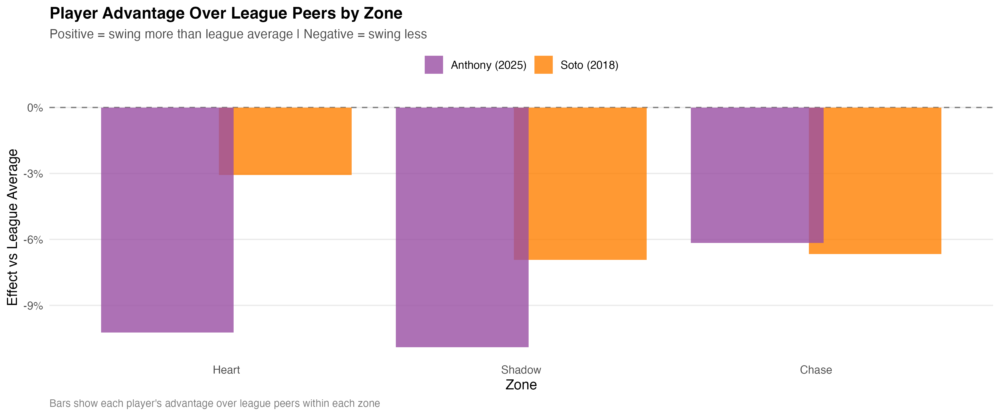
        
<em>significance present in "heart" and "shadow"</em>

        
        
<em>significance present in "fastball:heart", "fastball:shadow", "breaking:heart", "breaking:shadow", "breaking:chase"</em>

        <h3 id="barcontact">Contact</h3>
        
There is no statistical significance in these graphs. This makes sense: look at the y-axis scale, in contrast to that of the swinging graphs. For contact, percentage differences to league average per zone lies between -6% and 2%, whereas in swinging likelihood, it ranges from ~0% to over -20%.

        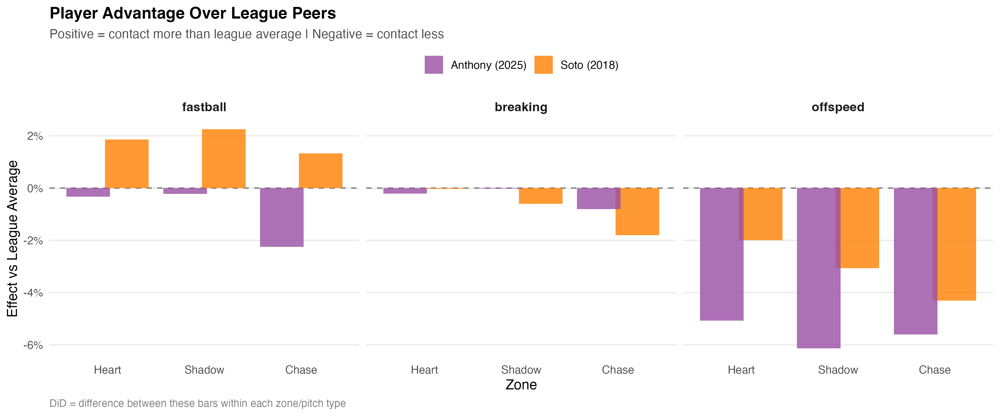
        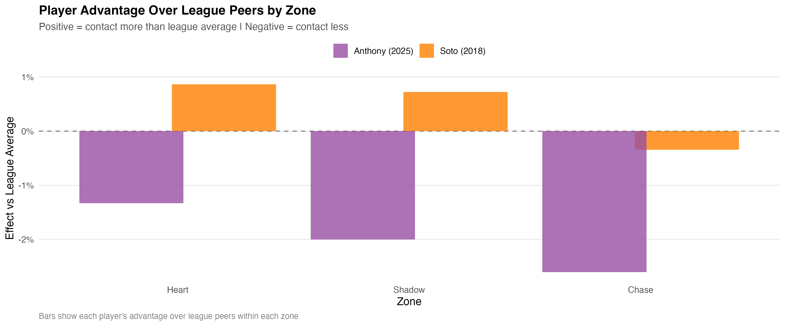

        <h2 id="summary-tables">Summary Tables</h2>
        
Just another way of presenting the same data.

        <h3 id="sumswing">Swinging</h3>
        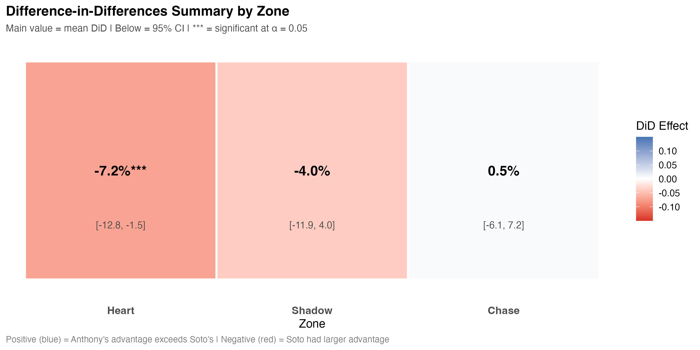
        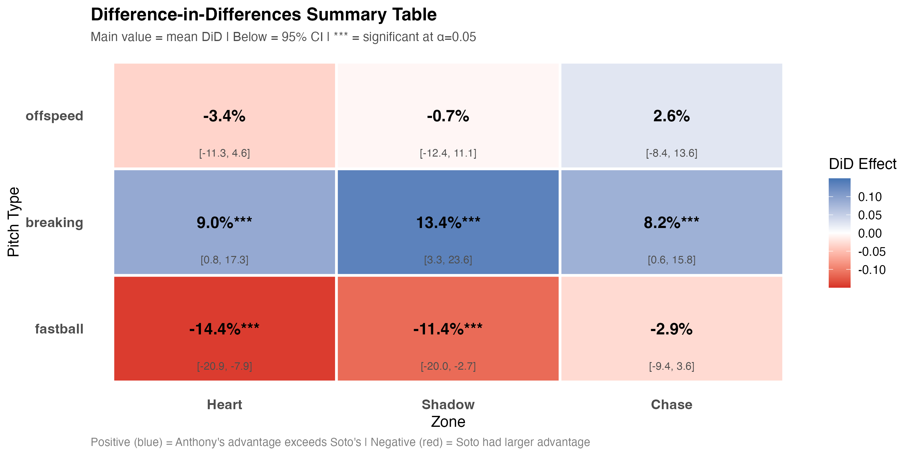

        <h3 id="sumcontact">Contact</h3>
        
        

        <h2 id="moresum">More Summary Tables for Exact Numbers (Calculated from Different Models)</h2>
        
<strong>DiD mean:</strong> average difference between Soto and Anthony's differences from the league average

        
<strong>DiD SE:</strong> standard error. "standard deviation of sampling distribution" (per wikipedia). When looking at significance, we can take a "sampling population" which is like testing a lot of slightly different populations to see how uniform our whole population is. The standard error measures how much the mean of each of these sampling populations differs from the mean of the whole population. This lets us calculate the confidence intervals.

        <table>
            <thead>
                <tr>
                    <th>pitch categoryPitch category classification (fastball, breaking ball, offspeed) based on velocity, movement, and spin characteristics.</th>
                    <th>zone</th>
                    <th>DiD mean</th>
                    <th>DiD SE</th>
                    <th>Soto mean</th>
                    <th>Anthony mean</th>
                    <th>CI low</th>
                    <th>CI high</th>
                    <th>significance</th>
                </tr>
            </thead>
            <tbody>
                <tr>
                    <td><strong>fastball</strong></td>
                    <td>Heart</td>
                    <td>-0.14367</td>
                    <td>0.03313</td>
                    <td>0.00453</td>
                    <td>-0.13913</td>
                    <td>-0.20863</td>
                    <td>-0.07872</td>
                    <td>TRUE</td>
                </tr>
                <tr>
                    <td><strong>fastball</strong></td>
                    <td>Shadow</td>
                    <td>-0.11350</td>
                    <td>0.04388</td>
                    <td>-0.02840</td>
                    <td>-0.14190</td>
                    <td>-0.19952</td>
                    <td>-0.02748</td>
                    <td>TRUE</td>
                </tr>
                <tr>
                    <td><strong>fastball</strong></td>
                    <td>Chase</td>
                    <td>-0.02902</td>
                    <td>0.03337</td>
                    <td>-0.04112</td>
                    <td>-0.07015</td>
                    <td>-0.09444</td>
                    <td>0.03638</td>
                    <td>FALSE</td>
                </tr>
                <tr>
                    <td><strong>breaking</strong></td>
                    <td>Heart</td>
                    <td>0.09020</td>
                    <td>0.04204</td>
                    <td>-0.15696</td>
                    <td>-0.06675</td>
                    <td>0.00779</td>
                    <td>0.17261</td>
                    <td>TRUE</td>
                </tr>
                <tr>
                    <td><strong>breaking</strong></td>
                    <td>Shadow</td>
                    <td>0.13439</td>
                    <td>0.05195</td>
                    <td>-0.20824</td>
                    <td>-0.07384</td>
                    <td>0.03255</td>
                    <td>0.23624</td>
                    <td>TRUE</td>
                </tr>
                <tr>
                    <td><strong>breaking</strong></td>
                    <td>Chase</td>
                    <td>0.08213</td>
                    <td>0.03862</td>
                    <td>-0.12769</td>
                    <td>-0.04555</td>
                    <td>0.00643</td>
                    <td>0.15784</td>
                    <td>TRUE</td>
                </tr>
                <tr>
                    <td><strong>offspeed</strong></td>
                    <td>Heart</td>
                    <td>-0.03354</td>
                    <td>0.04073</td>
                    <td>-0.01680</td>
                    <td>-0.05035</td>
                    <td>-0.11338</td>
                    <td>0.04628</td>
                    <td>FALSE</td>
                </tr>
                <tr>
                    <td><strong>offspeed</strong></td>
                    <td>Shadow</td>
                    <td>-0.00662</td>
                    <td>0.05995</td>
                    <td>-0.05528</td>
                    <td>-0.06190</td>
                    <td>-0.12412</td>
                    <td>0.11088</td>
                    <td>FALSE</td>
                </tr>
                <tr>
                    <td><strong>offspeed</strong></td>
                    <td>Chase</td>
                    <td>0.02582</td>
                    <td>0.05599</td>
                    <td>-0.07339</td>
                    <td>-0.04757</td>
                    <td>-0.08391</td>
                    <td>0.13556</td>
                    <td>FALSE</td>
                </tr>
            </tbody>
        </table>

        
This table looks at significance slightly differently. The filled in circle indicates significance. The significant area indicates if the region of the surface which makes the estimate significant is large, or if the fewer significant points are just, exceptionally significant. It's another way of thinking about this type of analysis, and I'm not sure if I am as confident in the results.

        <table>
            <caption>Difference-in-Differences Results by Zone and Metric</caption>
            <thead>
                <tr>
                    <th>Zone</th>
                    <th>Metric</th>
                    <th>DiD Estimate</th>
                    <th>95% CI</th>
                    <th>% Significant Area</th>
                </tr>
            </thead>
            <tbody>
                <tr>
                    <td>Heart</td>
                    <td>Contact Probability</td>
                    <td><b style="color:black;">-0.019 ●</b></td>
                    <td>[-0.023, -0.016]</td>
                    <td>25.3%</td>
                </tr>
                <tr>
                    <td>Shadow</td>
                    <td>Contact Probability</td>
                    <td><b style="color:black;">-0.026 ●</b></td>
                    <td>[-0.034, -0.017]</td>
                    <td>53.2%</td>
                </tr>
                <tr>
                    <td>Waste</td>
                    <td>Contact Probability</td>
                    <td><b style="color:black;">0.033 ●</b></td>
                    <td>[0.029, 0.037]</td>
                    <td>23.7%</td>
                </tr>
                <tr>
                    <td>Heart</td>
                    <td>exit velocityThe speed of the baseball as it comes off the bat after contact (mph) </td>
                    <td><b style="color:black;">-0.709 ●</b></td>
                    <td>[-0.796, -0.622]</td>
                    <td>0.0%</td>
                </tr>
                <tr>
                    <td>Shadow</td>
                    <td>exit velocityThe speed of the baseball as it comes off the bat after contact (mph) </td>
                    <td><b style="color:black;">0.420 ●</b></td>
                    <td>[0.336, 0.504]</td>
                    <td>0.0%</td>
                </tr>
                <tr>
                    <td>Waste</td>
                    <td>Exit Velocity</td>
                    <td>
